# PitapataPOP (개발명 · JojoPuzzle)

> 드래그로 조각을 옮겨 맞추는 **매치 퍼즐 배틀** 모바일 게임. Unity 2022.3 / URP / C#.
> 이 저장소는 취업 포트폴리오용 스냅샷입니다. 게임 코드(`Assets/Script`, `Assets/Editor`)는 전부 직접 작성했고,
> `Assets/Spine*` · `Assets/ExcelImporter` 는 서드파티 플러그인입니다.

<p align="center">
  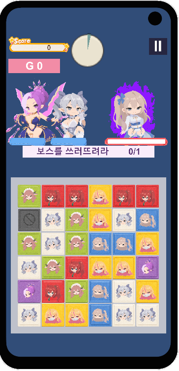
</p>

| | |
|---|---|
| **엔진** | Unity 2022.3.58f1 (URP 14, Linear 색공간) |
| **언어** | C# (네임스페이스 `JojoPuzzle`) |
| **플랫폼** | 모바일 세로 화면 (기기별 화면비 대응) |
| **규모** | 첫 파티(first-party) 스크립트 약 197개 파일 / 약 45,000줄 |
| **씬** | `Login` · `Apartment` · `StageSelect` · `SampleScene`(배틀) · `MiniGame` |

---

## 목차

1. [무엇을 만들었나](#무엇을-만들었나)
2. [핵심 게임 메커니즘](#핵심-게임-메커니즘)
3. [아키텍처 — 직접 내린 설계 결정들](#아키텍처--직접-내린-설계-결정들)
4. [알고리즘 하이라이트](#알고리즘-하이라이트)
5. [모바일 최적화](#모바일-최적화)
6. [데이터 주도 설계](#데이터-주도-설계)
7. [앱 전체 흐름과 씬 구성](#앱-전체-흐름과-씬-구성)
8. [구현한 시스템 목록](#구현한-시스템-목록)
9. [커스텀 에디터 도구 · Spine 통합 · VFX](#커스텀-에디터-도구--spine-통합--vfx)
10. [프로젝트 구조](#프로젝트-구조)
11. [알려진 한계 / 다음 작업](#알려진-한계--다음-작업)
12. [코드에서 먼저 볼 만한 곳](#코드에서-먼저-볼-만한-곳)

---

## 무엇을 만들었나

『ジョジョのピタパタポップ』풍의 캐릭터를 모티브로 한 **드래그 이동형 매치 퍼즐 배틀**입니다.
일반적인 스와이프-스왑 매치3와 달리, 조각 하나를 **집어서 자유롭게 끌고 다니다가 손을 뗀 자리에만
덮어쓰는** 조작이 기본이고, 그 위에 이 프로젝트 고유의 **스탠드업 타임**(게이지를 채워 발동하는
필살기 구간)을 얹었습니다.

배틀 한 판만이 아니라 **로그인 → 아파트(메인) → 스테이지 선택 → 편성 → 배틀 → 결과 → 복귀**로
이어지는 앱 전체 골격, 그리고 상점·은행·우편함·미니게임(도박)·스티커 같은 메타 시스템까지
직접 설계하고 구현했습니다.

가장 신경 쓴 부분은 **로직/뷰 분리**, **상태 모델을 bool 더미가 아니라 하나의 열거형과 이름 붙은
질문으로 정의하기**, **런타임 할당·Destroy 를 없앤 모바일 최적화**, 그리고 **캐릭터·스킬·스테이지가
계속 늘어나도 코드를 안 고치도록 데이터로 확장 지점을 여는 것**입니다.


<p align="center">
  <video src="https://github.com/user-attachments/assets/bbe185d2-9417-4d58-adfa-33aa42fcc924" controls width="240"></video>
  <br>
  <sub>전체 플레이 — 로그인 → 아파트 → 편성 → 배틀(퍼즐) → 미니게임(도박)</sub>
</p>

---

## 핵심 게임 메커니즘

### 드래그 이동 매치 (스왑 아님)

- 6×6 보드. 조각 하나를 집어 **경로는 무시하고 손 뗀 칸만** 데이터에 반영(덮어쓰기, 스왑 아님).
- 같은 색 **4개 이상** 연결 시 매치, **6개 이상**이면 박스(큐브) 아이템 생성.
- 자유 드래그라서 매치3의 상식이 뒤집힙니다. "많은 색을 주면 어려워진다"가 아니라 **쉬워지고**,
  진짜 난이도 레버는 팔레트 색 수입니다. 그런 판단이 코드 곳곳 주석에 남아 있습니다.

<p align="center">
  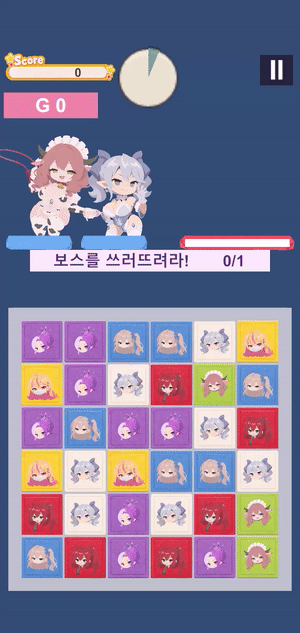
  <br>
  <sub>조각을 자유롭게 끌어다 놓고, 6개를 맞추면 박스 아이템이 생기는 모습</sub>
</p>

### 스탠드업 타임 — 프로젝트 고유 메커니즘

```
스킬 게이지 만충 → 개시 배너(글자 두 덩이가 부딪힘)
  → 10초간: 매치돼도 안 지워지고 그 자리에 고정(StandHeld)
  → 고정 조각들이 정사각형으로 합체 (2×2 ~ 6×6, 크기마다 데미지 배율)
  → 종료: 덩어리별로 불꽃이 되어 리더에게 흡수 → 적 정중앙에 총 데미지
```

- 고정 조각은 낙하에서 "벽"이 아니라 **"고정"**(위 조각은 통과, 자기 칸만 안 움직임)으로 처리해
  "밑에서 새 조각이 솟는" 그림을 방지 — `Cell.BlocksGravity` vs `Cell.PinnedInGravity` 로 구분.
- 정사각형 데미지 = `전투력 × 실효 칸 수 × 크기배율`. 크기배율은 상수 테이블
  (2×2=1.3배 … 6×6=17.5배, [`StandUpDamageTable`](Assets/Script/Core/StandUpDamageTable.cs)).
- 원래 기획 엑셀의 2단계 공식은 데미지가 전투력의 제곱으로 커져 레벨 곡선을 망가뜨렸기에,
  **선형 비례로 재설계**하고 그 근거를 코드 주석에 남겼습니다.

<p align="center">
  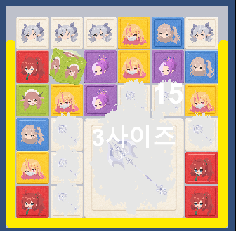
  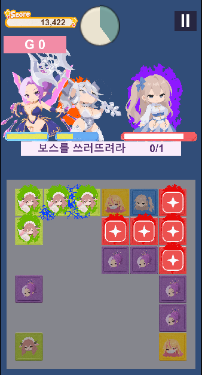
  <br>
  <sub>왼쪽: 정사각형으로 합쳐지는 순간 · 오른쪽: 불꽃이 리더에게 흡수되고 최종 데미지가 들어가는 순간</sub>
</p>
<p align="center">
  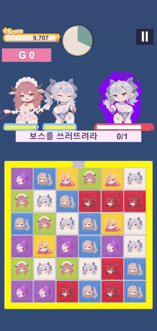
  <br>
  <sub>발동 알림 → 사이즈업 고정 → 최종 데미지까지 한 사이클</sub>
</p>

---

## 아키텍처 — 직접 내린 설계 결정들

### 1. 로직 / 뷰 완전 분리

```
[순수 C# · UnityEngine 참조 0 · 단위 테스트 가능]        [렌더링 전담]
  BoardData / Cell (struct)                               BoardView   (2,472줄)
  BoardManager        (2,046줄)                           PanelView   (1,238줄)
  ConnectionFinder / SquareMergeFinder / BoardGenerator   PanelViewPool
        │                                                      ▲
        └───────────── 명령(Animate* / Apply* / Place*) ───────┘
```

`BoardData`·`BoardManager`·`ConnectionFinder`·`SquareMergeFinder` 는 `UnityEngine` 타입도
`BoardView` 도 **한 줄도 참조하지 않습니다**. 방향은 항상 로직 → 뷰이고, 뷰의 public API 는
대부분 명령형입니다.

### 2. `Cell` 을 구조체로 두고 조각의 모든 임시 상태를 그 안에 담기

[`BoardData.cs`](Assets/Script/Core/BoardData.cs) 의 `Cell` 은 종류·색뿐 아니라
`unsettleRemaining`(안착 타이머), `bornFromBox`, `empowerMultiplier`(강화 배율),
`specialMatchesLeft`, `specialSummonOrder`, `holeRemaining` 을 전부 들고 있습니다.

> **왜 구조체 안인가**: 낙하로 조각이 옮겨지면 구조체가 통째로 복사되며 이 값들이 **자동으로
> 따라가고**, 칸이 비거나 덮어써지면 자연히 사라집니다. 별도 좌표 테이블로 빼면 그 동기화를
> 전부 손으로 해야 하고, 매치로 사라질 때 지우는 걸 잊기 쉽습니다.

`IsConnectable`, `BlocksNormalOverwrite`, `PinnedInGravity`, `CanBeDragged`, `DamageWeight` 같은
**파생 프로퍼티 한 곳**에 규칙을 모아, 새 방해요소가 생겨도 여기만 확장하면 매치·낙하·드래그
판정 전체에 재사용됩니다.

### 3. 상태 모델 — bool 더미가 아니라 열거형 + 이름 붙은 질문

배틀 단계는 [`BattlePhase`](Assets/Script/Core/BattlePhase.cs) 열거형 하나입니다
(`Intro → Playing → Ending → RushTime → Finished`).

> 예전에는 이걸 `IsIntroPlaying` / `IsFinishing` / `IsRushTimeActive` / `IsBattleEnded` 네 개의
> 따로 노는 bool 로 뒀습니다. 서로 배타적인 값인데 따로 두니 묻는 쪽마다
> `IsRushTimeActive || IsFinishing || IsBattleEnded` 같은 줄이 생겼고, 단계가 늘 때 한 군데를
> 빠뜨려 **실제 버그**(러시 안내 위로 배너가 덮침)가 났습니다.

지금은 판정을 **이름 붙은 질문으로 한 번만** 정의합니다 — `IsPlayablePhase`, `CanPickUpPiece`,
`MustReleaseHeldPiece`, `IsBoardStopped`, `IsOutcomeAnnouncementBlocked`.
대사창·암전·일시정지·스탠드업 배너처럼 **잠깐 겹쳤다 사라지는 가림막**은 단계가 아니라 별도 축으로
보고, 그 켜짐 이유를 `BoardDimReason` 비트 플래그로 모아 **하나라도 남아 있으면 유지**합니다.

### 4. 거대 클래스를 심(seam) 단위로 분해

`BoardInputController` 는 한때 3,182줄 / 필드 52개 / 메서드 75개였습니다.
"한 스크립트 한 기능, 200~300줄을 넘으면 이음매를 찾아 나눈다"는 원칙으로 아래를
**작은 인터페이스와 공유 객체 뒤로** 떼어냈습니다.

| 떼어낸 것 | 파일 | 주인에게 받는 창구 |
|---|---|---|
| 힌트 시계·탐색 | [`Borad/BoardHint.cs`](Assets/Script/Borad/BoardHint.cs) | — (MonoBehaviour 아님, 시계와 좌표뿐) |
| 낙하·연쇄 | [`Borad/BoardCascade.cs`](Assets/Script/Borad/BoardCascade.cs) | [`ICascadeHost`](Assets/Script/Borad/ICascadeHost.cs) + `BoardCellLocks` |
| 매치 판정·처리 | [`Borad/MatchResolver.cs`](Assets/Script/Borad/MatchResolver.cs) | [`IMatchHost`](Assets/Script/Borad/IMatchHost.cs) + `BoardCellLocks` |
| 미스틱 특수 퍼즐 | [`Borad/SpecialPuzzle.cs`](Assets/Script/Borad/SpecialPuzzle.cs) | `BoardCellLocks` + 낙하 요청 콜백 |
| 유나 점화 블록 발동 | [`Borad/BurnTrack.cs`](Assets/Script/Borad/BurnTrack.cs) | `BoardCellLocks` |

인터페이스는 "주인에게 물어야 하는 것"만 좁혀서 받습니다 — 예를 들어 `ICascadeHost` 는
`IsBoardStopped` / `IsFallFrozen` / `IsStandUpTimeActive` / `IsFinisherRunning` /
`IsHeldByPlayer(cell)` / `ResolveMatch(...)` 여섯 멤버뿐입니다.
`BoardInputController` 가 그 인터페이스들을 구현하고, 판을 고치는 쪽은 필드가 아니라 이 창구만
받습니다. 큰 덩어리는 손으로 옮기지 않고 **잘라 붙인 뒤 원문과 기계적으로 대조**해서 옮겼습니다
(이음매 몇 곳 말고는 한 글자도 안 달라졌음을 확인).

### 5. 잠금은 세 겹 — 공유 객체 [`BoardCellLocks`](Assets/Script/Borad/BoardCellLocks.cs)

판 위에서 매치 처리·낙하·리필·스킬 연출이 **동시에** 돌 수 있어, 어느 칸이 "지금 다른 처리가
쓰는 중"인지 표시해 두지 않으면 서로 같은 칸을 가져갑니다. 그 표시를 집합 셋을 든 객체 하나로
모으고 **다들 그냥 나눠 듭니다**(예전엔 입력 컨트롤러가 구현하는 인터페이스였는데 처리가 늘 때마다
멤버가 붙어서 객체로 뺐습니다).

- **기본(Claim)** — 자동 처리가 못 건드림. 집는 중, 매치 처리 중.
- **전용(Exclusive)** — 아무도 못 건드림. 스킬 연출처럼 칸이 통째로 바뀔 때.
- **안착(Settling)** — 자동 처리만 막고 손은 열어 둠. 데이터는 확정, 연출만 남았을 때.
  (안착까지 손을 막으면 스탠드업 중 낙하·리필 연출마다 손이 0.5초씩 묶입니다.)

잠금을 켠 코루틴은 **반드시 `try/finally` 로 풀고**, 그래도 새는 경우를 대비해 `RefillBoard`
끝에 "주인 없는 빈 칸의 잠금을 뺏고 한 번 더 채우는" 그물(`ForceReleaseEmptyCells`)을 뒀습니다 —
새 연출이 붙어도 "러시가 빈 칸을 낀 채 시작한다"류 증상이 안 돌아옵니다.

### 6. "연출은 데이터 뒤를 따른다"

> 모든 연출은 접기 연출처럼 만듭니다: 데이터는 **이미 처리된 상태**이고, 지금 보이는 것은
> 완료된 일을 뒤늦게 보여주는 겉보기일 뿐입니다.

순서는 항상 `데이터 커밋 → 연출`. 연출을 기다렸다가 커밋하지 않습니다.
화면이 데이터보다 앞서면 그 사이에 "보이는 것과 실제가 다른 창"이 생기고, 판을 만지는 쪽
(입력·낙하·리필·매치 스캔)이 저마다 그 창을 따로 알아야 합니다 — 하나만 빠뜨려도 조용히
샙니다. 데이터를 먼저 확정하면 `CanBeDragged` 같은 기존 판정이 저절로 옳은 답을 하므로,
창을 막는 특별 장치 자체가 필요 없어집니다. (안착/미안착을 쓰는 **스킬만 예외**입니다.)

---

## 알고리즘 하이라이트

### 정사각형 최적 분할 — [`SquareMergeFinder`](Assets/Script/Borad/SquareMergeFinder.cs)

스탠드업 타임에 같은 색으로 이어진 영역을 정사각형 블록들로 쪼갤 때, "가장 큰 것부터"
그리디로 집으면 같은 크기 후보가 여럿일 때 어느 걸 집느냐로 나머지 정사각형 수가 갈립니다 —
플레이어가 실제로 만든 모양보다 데미지가 깎였습니다(무작위 무리의 1.6%, 최악 −8.5%).

지금은 **겹치지 않는 정사각형 조합 중 데미지 보너스 합이 최대**인 걸
`ulong` 비트마스크 DFS + 메모이제이션으로 정확히 찾습니다.

- 입력을 좌표로 **정렬**한 뒤 계산 — 화면 합체와 데미지 계산이 서로 다른 경로로 같은 무리를
  넘겨서, 순서에 따라 답이 갈리면 보이는 덩어리와 데미지가 어긋납니다.
- `preferred` 인자(지금 화면에 합쳐져 있는 정사각형)를 받아, **데미지 동점일 때 기존 자리를 유지**.
  보너스를 1000배로 부풀리고 기존 자리에만 +1 — 진짜 데미지 차이는 절대 못 뒤집습니다.
- 64칸 초과 또는 상태 20만 개 초과면 표준 최대 정사각형 DP(그리디)로 물러서는 안전장치.
- Python 으로 포팅해 퍼즈 테스트(2×2 가능한 경우 582회 포함)로 겹침·영역 이탈 0 확인.

### 힌트 — "조각 하나만 옮기면 매치가 되는 자리가 있는가"

[`BoardManager.TryFindHint`](Assets/Script/Borad/BoardManager.cs) 는 3칸짜리 무리만 찾지
않습니다. 2칸 덩어리 둘 사이에 하나를 끼워도 2+2+1=5 로 매치가 되기 때문입니다.

1. 같은 색 덩어리에 이름표를 붙이고 (`LabelHintComponents`)
2. 놓을 자리마다 이웃 4칸의 덩어리 합 +1 로 낙관적 상한을 구해 후보를 거른 뒤
3. 후보마다 **실제로 옮겨본 결과를 정확히 센다** (`FillGroupAfterMove` — 보드를 안 건드리고
   "donor 칸은 비었다"고 치고 BFS).

③이 없으면 donor 가 세어진 덩어리 안에 있을 때 옮기는 순간 덩어리가 끊어질 수 있고, 그렇다고
"덩어리 안이면 제외"로 두면 멀쩡한 수를 놓칩니다 — Python 퍼즈(무차별 대입과 대조, 3,506판 /
수 없는 판 704개 포함)로 잡은 버그입니다.

### 탐색 버퍼 재사용 — [`ConnectionFinder`](Assets/Script/Borad/ConnectionFinder.cs)

보드 전체 스캔은 칸마다 BFS 를 부르는데 대부분의 결과가 "4개 미만이라 버려지는 그룹"입니다.
그래서 탐색 함수를 **"버퍼 채우기(`Fill~`)"** 와 **"새 리스트 반환(`Find~`)"** 으로 나눠,
스캔은 공용 `visited` 1차원 배열과 `Queue` 를 돌려쓰고 매치가 성립한 그룹만 새 리스트로 복사합니다.
컬렉션 파라미터도 `IEnumerable` 이 아니라 `List` 로 받습니다(`foreach` 열거자 박싱 회피).

---

## 모바일 최적화

> 모바일이라 발열·배터리에 민감합니다. "이벤트마다 새로 만들고 버리는" 패턴이 보이면 먼저
> 캐싱·풀링으로 대체할 수 있는지 검토하는 것을 기본으로 삼았습니다.

- **런타임 `Destroy` / `Instantiate` 0회.** [`PanelViewPool`](Assets/Script/Panel/PanelViewPool.cs)
  이 스택으로 뷰를 재사용하고, 풀이 비면 새로 만들지 않고 가장 오래된 것을 회수합니다.
  데미지 팝업·콤보 라벨·뭉게구름·스파크·크기 라벨도 전부 같은 풀링 패턴.
  (덤: `Destroy` 는 프레임 끝에 지연 처리돼 그 프레임 동안 잔상이 남는데, 풀은 `SetActive(false)`
  로 즉시 사라져 "지워진 조각과 새 조각이 겹쳐 보이는" 문제를 근본적으로 없앱니다.)
- **오브젝트마다 코루틴을 띄우지 않음.** 낙하·불꽃 이동·데미지 팝업·강화 스파크·펄스 숨쉬기를
  전부 **하나의 `Update` 루프가 배치로** 처리(코루틴 36개 → 1개로 리팩터링).
- BFS/스캔 버퍼를 rent-and-reuse. 게이지 경로 배열·정사각형 재계산 내부 리스트도 재사용 버퍼.
- 큐브 텍스처를 (프레임, 아이콘) 조합별로 static Dictionary 에 **캐싱** — 게임 중 합성/해제 0회.
- `Texture2D.GetPixels` / `isReadable` 의존 **완전 제거** — `Graphics.Blit → ReadPixels` 로
  GPU 를 거쳐 필요한 크기(128px 이하)로만 받습니다. CPU 사본이 안 남고 임포트 설정도 안 건드림.
- 정사각형 재계산 함수는 중간에 `yield` 하지 않는 **완전 동기 함수** — 매치가 동시에 여러 개
  돌아도 호출이 안 겹쳐 내부 버퍼 재사용이 안전합니다(그래서 여기 `yield` 를 넣지 않음).

---

## 데이터 주도 설계

캐릭터·스킬·스테이지·아이템이 계속 늘어나므로, 확장 지점을 **코드가 아니라 데이터**로 엽니다.
`if (character == mystic)` 같은 분기는 두지 않습니다.

### 스킬 — 효과 조합형 [`SkillDefinition`](Assets/Script/Core/SkillDefinition.cs)

`PanelType.skill → SkillDefinition(애셋) → SkillEffect[]`.
효과를 **조합해서** 스킬을 만듭니다. 새 캐릭터가 와도 `SkillEffectKind` 에 항목을 늘리거나
기존 효과를 배열에 담기만 하면 되고, 연출 코드([`SkillPresentation`](Assets/Script/UI/SkillPresentation.cs))는
"대사 → 암전 → 구름 → 적용" 순서만 책임집니다.

| `SkillEffectKind` | 무엇을 | 캐릭터 |
|---|---|---|
| `ConvertRegion` | 지정 칸을 그 색으로 | 라뷰린스 (고정 범위) |
| `EmpowerColor` | 판의 그 색 조각 전부 강화 | 카우펜스 |
| `ScatterConvert` | 뿌려서 뿌리처럼 뻗으며 강화 | 라미아 「브릴란스」 |
| `SpecialAnchor` | 무작위 정사각 구역을 특수 패널로 박음 | 미스틱 「포지셔닝」 |
| `CrossWipe` | 무작위 열·행을 쓸고 자기 색으로 채움 | 루바니아 「검은 파동!」 |
| `BurnTrack` | 맨 아랫줄에 점화 블록을 놓기만 함 | 유나 「버닝 트랙!」 |

<table>
<tr>
<td width="16.6%" align="center">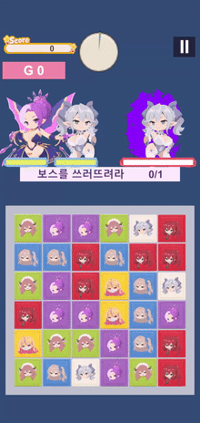<br><sub>라뷰린스<br>ConvertRegion</sub></td>
<td width="16.6%" align="center">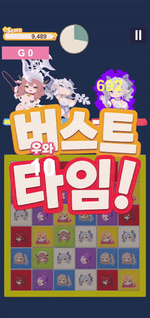<br><sub>카우펜스<br>EmpowerColor</sub></td>
<td width="16.6%" align="center">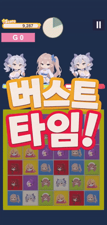<br><sub>라미아 「브릴란스」<br>ScatterConvert</sub></td>
<td width="16.6%" align="center">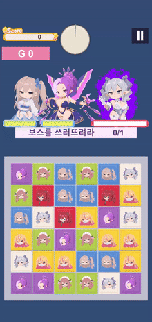<br><sub>미스틱 「포지셔닝」<br>SpecialAnchor</sub></td>
<td width="16.6%" align="center">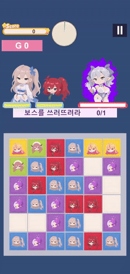<br><sub>루바니아 「검은 파동!」<br>CrossWipe</sub></td>
<td width="16.6%" align="center">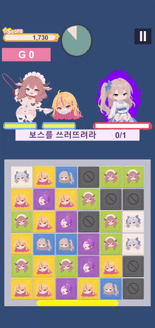<br><sub>유나 「버닝 트랙!」<br>BurnTrack</sub></td>
</tr>
</table>

`ScatterConvert` 의 제동 장치(강화된 조각은 탐지에서 빠져 연쇄가 저절로 짧아짐),
`SpecialAnchor` 가 도입한 새 `CellKind.Special`(자기들끼리는 매치 불가, 중력·변환·상자 전부
버팀), `BurnTrack` 이 도입한 `CellKind.BurnTrack`(드래그로 옮길 수 있고 조각이 닿는 순간 발동)
— 캐릭터마다 물어서 확정한 규칙이 코드에 근거와 함께 남아 있습니다.

### 특수 블록 소환 규칙을 한 곳에 — [`CellPlacement`](Assets/Script/Core/CellPlacement.cs)

특수 블록을 놓을 자리는 **놓는 쪽마다 따로 정하지 않고** 공통 기준을 씁니다:
`1순위 자기 구역 → 2순위 퍼즐 우선순위(일반=방해블록 < 큐브 < 특수 블록) → 3순위 가까운 구역`.
특수 블록끼리는 `Cell.specialSummonOrder`(소환 순번)로 **나중에 소환한 쪽이 우선권**을 갖고,
지울 땐 번호가 작은 것부터 내줍니다.

그리고 **성향은 스킬 애셋의 필드**(`PlacementStyle`)입니다 —
`Careful`(유나: 세 순위를 지킴) vs `Reckless`(미스틱: 등급을 아예 안 보고 무작위).
"스킬은 캐릭터의 성격을 보여주는 장치"라는 기획이 데이터로 표현됩니다.

### 그 밖의 데이터 애셋 / 순수 테이블

- **ScriptableObject**: `PanelType`, `SkillDefinition`, `StageDefinition`, `ChapterDefinition`,
  `CharacterSpeechSet`, `CharacterPersonality`, 그리고 카탈로그들
  (`ChapterCatalog` · `BattleItemCatalog` · `StickerCatalog` · `ShopCatalog` · `FoodCatalog` ·
  `ExpItemCatalog` · `GachaBanner` · `CharacterTasteTable` · `BankPlanCatalog`) — `Assets/Data/`.
- **순수 정적 테이블**(씬 배치·참조 없이 조회만): [`CharacterGrowthTable`](Assets/Script/Core/CharacterGrowthTable.cs)
  (등급 GR/SR/BR × 레벨 1~50 전투력 곡선 + 누적/필요 경험치, 기획 엑셀에서 이식),
  [`StandUpDamageTable`](Assets/Script/Core/StandUpDamageTable.cs),
  [`GoldReward`](Assets/Script/Core/GoldReward.cs)(결과 화면 골드 영수증 — 밑돌·레벨보정·러시·
  적레벨·아이템·스티커 배율/덧셈/큰한방을 줄 단위로).
- 대사는 상황만 알리는 [`SpeechTrigger`](Assets/Script/Core/SpeechTrigger.cs) 열거형 +
  캐릭터별 `CharacterSpeechSet` 애셋으로 분리 — 게임 코드는 안 바뀝니다.

---

## 앱 전체 흐름과 씬 구성

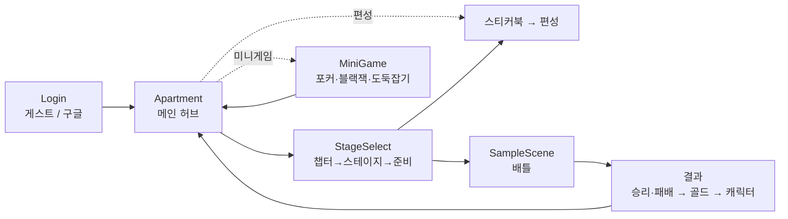

<table>
<tr>
<td width="20%" align="center">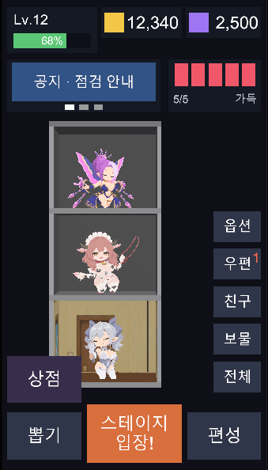<br><sub>아파트 메인</sub></td>
<td width="20%" align="center">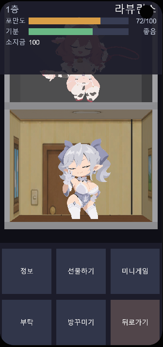<br><sub>방 확대 · 입주</sub></td>
<td width="20%" align="center">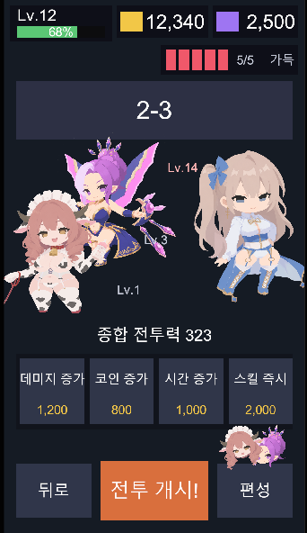<br><sub>스테이지 선택 · 준비</sub></td>
<td width="20%" align="center">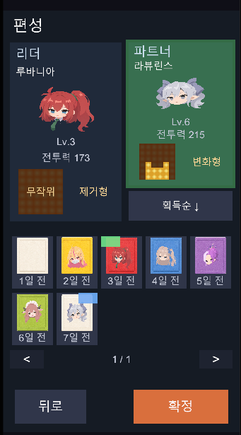<br><sub>편성</sub></td>
<td width="20%" align="center">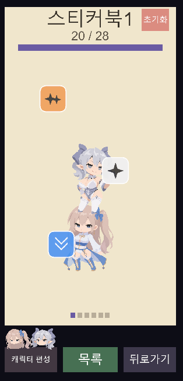<br><sub>스티커북</sub></td>
</tr>
<tr>
<td width="20%" align="center">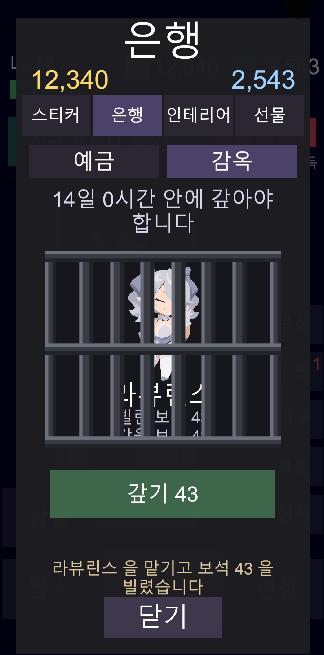<br><sub>은행</sub></td>
<td width="20%" align="center">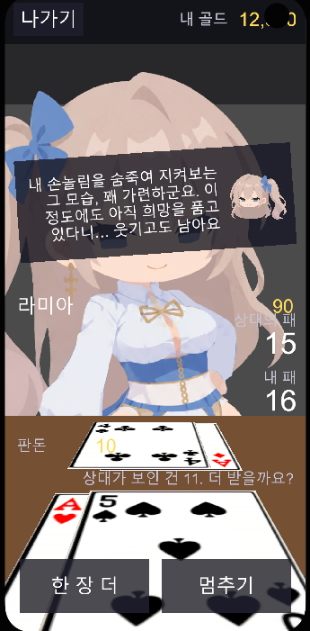<br><sub>미니게임 · 블랙잭</sub></td>
<td width="20%" align="center">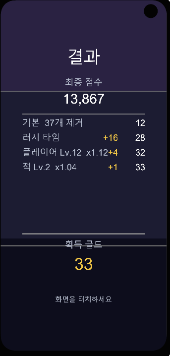<br><sub>결과 정산</sub></td>
<td width="20%" align="center">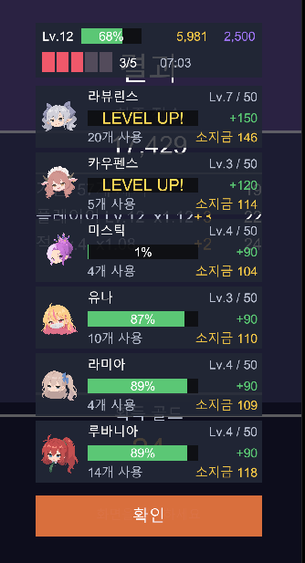<br><sub>캐릭터 성장 결과</sub></td>
<td width="20%"></td>
</tr>
</table>

- **씬을 여러 개로 나눔.** 씬 이름 문자열은 [`AppScenes`](Assets/Script/App/AppScenes.cs) **한 곳**.
- **씬 사이 전달은 consume-once static** — [`PartySelection`](Assets/Script/App/PartySelection.cs),
  [`StageEntry`](Assets/Script/App/StageEntry.cs), [`MiniGameEntry`](Assets/Script/App/MiniGameEntry.cs),
  [`ScreenRequest`](Assets/Script/App/ScreenRequest.cs), [`SessionState`](Assets/Script/App/SessionState.cs).
  요청은 확인하는 순간 지웁니다(안 지우면 그 뒤로 계속 끌려감).
- **되돌릴 수 없는 차감은 한 곳에서 all-or-nothing** — `StageEntry.Commit()` 이 하트·골드를
  차감하고, 하나라도 모자라면 아무것도 안 빼고 `false`. 아이템은 **보유분이 먼저 나가고**
  다 쓴 뒤에야 그 고름이 구매가 됩니다.
- **인증은 SDK 를 모르는 이음매** — [`IAuthProvider`](Assets/Script/App/AuthProvider.cs) +
  `GuestAuthProvider`(실제 동작, PlayerPrefs 에 id 하나만) + `GoogleAuthProviderStub`(버튼 비활성).
  나중에 Firebase / Google Play Games 를 붙일 때 구현체 하나만 갈아끼우면 됩니다.
- **부팅 순서는 명시적** — [`GameEntryPoint`](Assets/Script/Core/GameEntryPoint.cs) 가
  팔레트 결정 → 보드 생성 → BoardManager → 뷰/입력 초기화 → 스티커 효과 →
  초상화 바인딩 → 카메라 핏 → 배틀 시작(반드시 마지막)을 6단계로 조율합니다.
- **연출은 시계만 미룬다** — `BeginBattle(deferStart: true)` 는 적 체력·팔레트·아이템 효과를
  지금 다 적용하고 제한시간 시계만 시작 연출이 끝날 때 돌립니다.

---

## 구현한 시스템 목록

> ✅ 구현 완료 · 🔶 동작하나 미연결/미조정 · ⛔ 자리만 있음

### 배틀 (`Assets/Script/Borad`, `Input`, `Battle`, `UI`)

| 시스템 | 상태 | 비고 |
|---|---|---|
| 6×6 드래그 매치 · 캐스케이드 · 리필 | ✅ | 즉시 매치 회피, 동시 매치 처리 |
| 박스(큐브) 아이템 · 십자 변환 | ✅ | 박스로 생긴 조각은 새 박스를 못 만듦(`bornFromBox`) |
| 스탠드업 타임(고정·정사각형 합체·불꽃 흡수) | ✅ | 개시 배너, 크기 라벨, 커밋 대기 창 처리 |
| 스킬 게이지(리더+파트너 동시 충전) | ✅ | 캐릭터별 분모, 만충 연출 |
| 캐릭터 스킬 6종 | ✅ | 위 [데이터 주도 설계](#데이터-주도-설계) 표 참고 |
| 강화(파트너) — 배율을 조각에 실음 | ✅ | 일반 매치·스탠드업·낱개 세 경로 자동 반영 |
| 적의 가벼운 방해(색 바꾸기 / 방해블록 / 구멍) | ✅ | 트리거는 스테이지 데이터, 스탠드업 중엔 금지 |
| 힌트(조각 하나 옮기면 되는 수) | ✅ | Python 퍼즈 검증, 콤보와 분리 |
| 연속 매칭 카운트 | ✅ | 5회/이후 10배수마다 칭찬 음성+이미지 |
| 러시 타임(시간 1/3+ 남기고 승리 시 보너스) | ✅ | 골드 직접 획득 |
| 배틀 보조 아이템 4종(데미지/코인/시간/스킬즉시) | ✅ | 개수제, 우편함이 배부 |
| 제한시간 · 승패 판정 · 타임오버 유예 | ✅ | 패배 조건은 시간 초과 하나뿐 |
| 데미지/점수/체력바/타이머 HUD | ✅ | 퍼센트 앵커 + 보드 실제 윗변 동기화 |
| 매치 마무리·데미지 팝업·타격 연출 | ✅ | 파편/파장/가루, 젤리 감쇠 진동 |

### 전투 개시 / 결과 (`Assets/Script/Battle`, `UI`)

| 시스템 | 상태 |
|---|---|
| 전투 개시 연출(퇴장→씬전환→입장→참가 조각→보스 대사→"시작!") | 🔶 컴파일·씬 검증 통과, 미(未)플레이 테스트 |
| 승리 연출(`BattleResultPanel`) · 패배(`BattleDefeatPanel`) | ✅ |
| 결과 화면(`BattleRewardPanel`, 골드 영수증) | ✅ |
| 캐릭터 결과 화면(`BattleCharacterPanel`) → 아파트 복귀 | ✅ |

### 메타 화면 (`Assets/Script/App`, `Apartment`, `StageSelect`, `Formation`)

| 시스템 | 상태 | 파일 |
|---|---|---|
| 로그인(게스트 동작 / 구글 스텁) | ✅ | `App/AuthProvider`, `App/LoginSceneController` |
| 아파트 — 방 터치→카메라 확대→입주 화면 | ✅ | `Apartment/ApartmentRoomFlow` 외 23개 |
| 아파트 방 입주(한 방 한 명, 이사 처리) | ✅ | `App/ApartmentResidents` |
| 스테이지 선택(챕터→스테이지→준비, 한 씬 안 패널) | ✅ | `StageSelect/*` |
| 편성(리더/파트너, 정렬·페이지, 스킬 범위 미리보기) | ✅ | `Formation/FormationPanel` |
| 캐릭터 상세 + 레벨업(경험치 아이템) | ✅ | `Formation/CharacterDetailPanel`, `App/CharacterLeveling` |
| 스티커북(6권 프리셋, 스와이프, 코스트 제한) | 🔶 | 붙이기까지 동작, 전투 반영은 미연결 |
| 상점 — 은행(예금+담보 대출) | ✅ | `Apartment/BankView`, `App/Bank`, `App/BankLoan` |
| 상점 — 인테리어(개수제, 방꾸미기) | ✅ | `Apartment/ShopPanel`, `RoomDecorPanel` |
| 상점 — 스티커/선물 | ⛔ | 규칙 미정 / 보류 |
| 우편함(아이템 배부) | ✅ | `App/Mailbox`, `Apartment/MailboxPanel` |
| 뽑기 | ⛔ | "준비 중" 안내 |
| 미니게임 — 인디언 포커 | ✅ | `MiniGame/MiniGameFlow` + `PokerAI` |
| 미니게임 — 블랙잭(캐릭터가 딜러) | ✅ | `MiniGame/BlackjackFlow` + `BlackjackAI` |
| 미니게임 — 도둑잡기 | ✅ | `MiniGame/OldMaidFlow` + `OldMaidAI`, 카드는 테이블 위 3D |
| 미니게임 공통 골격(캐릭터 세우기·인사·목록·나가기) | ✅ | `MiniGame/MiniGameSession` — `MiniGameKind` 에 한 줄로 확장 |
| 미니게임 상대 AI = 성격 시트 구동 | ✅ | `PokerAI` 가 honesty/courage/aggression/greed 로 허세·콜·레이즈 결정 |
| 공용 상태 표시줄(레벨/경험치/골드/보석/하트) | ✅ | `UI/PlayerStatusBar` (아파트·준비 화면 공유) |

---

## 커스텀 에디터 도구 · Spine 통합 · VFX

### 반복 작업용 에디터 창 (`Assets/Editor`)

- [`CharacterSpineBinder`](Assets/Editor/CharacterSpineBinder.cs) — 프로젝트의 모든 `PanelType`
  과 `Assets/SpineChar` 밑 스켈레톤을 훑어 표로 보여주고, 이름·번호로 짝을 짐작해 **원버튼으로**
  대사 애셋 생성 → `PanelType.speech` 연결 → 스켈레톤 주입까지. 틀린 짐작은 한 번만 고치면 됩니다.
- [`SpinePortraitSetup`](Assets/Editor/SpinePortraitSetup.cs) — 아틀라스가 여러 페이지라
  `SkeletonGraphic` 이 자식 `CanvasRenderer` 를 Spine 내부 코드로 만들어야 하는 초상화 배치를
  자동화(YAML 로는 흉내 불가).
- [`SpineMecanimSwitch`](Assets/Editor/SpineMecanimSwitch.cs) — 코드 제어 ↔ Animator 제어 전환 +
  "오브젝트당 애니메이션 컴포넌트 1개" 검증.

### Spine 재생은 한 곳을 지난다

애니메이션은 이름으로 재생하고([`SpinePlayback`](Assets/Script/UI/SpinePlayback.cs)),
**없는 동작은 그 캐릭터의 `1.idle` 로 메웁니다**(새 캐릭터는 idle 만 넣을 가능성이 높음).
런타임에 초상화를 이번 판의 캐릭터로 갈아끼우고([`BattlePortraitBinder`](Assets/Script/UI/BattlePortraitBinder.cs)),
`state.Data.DefaultMix` 와 `TrackEntry.MixDuration` 을 눌러 동작이 섞이지 않게 합니다.

### VFX

- 불꽃 셰이더 그래프 아우라 + ember 소멸(타는 경계선만 남기는 능선 노이즈).
- 흰색 UI 를 밝게 못 곱하는 문제 → `Blend SrcAlpha One` 가산 UI 셰이더로 해결.
- `SkillReadyRing` / `GaugeEdgeGlow` / `CloudPuff` / `Spark` 스프라이트를 Python 으로 직접 생성
  (PIL 없이 zlib+struct 인코딩, 거리변환 자체 구현).

---

## 프로젝트 구조

```
Assets/
├── Script/                     # 첫 파티 게임 코드 (약 193개 파일)
│   ├── Core/       (30)        # 데이터·열거형·순수 테이블·GameEntryPoint
│   ├── Borad/      (13)        # 보드 로직/뷰 (폴더명 오타는 의도적 유지)
│   │   ├── BoardManager.cs · BoardData.cs · BoardView.cs
│   │   ├── ConnectionFinder.cs · SquareMergeFinder.cs · BoardGenerator.cs
│   │   ├── BoardCascade.cs · MatchResolver.cs · BurnTrack.cs · SpecialPuzzle.cs
│   │   ├── BoardHint.cs · BoardCellLocks.cs
│   │   └── ICascadeHost.cs · IMatchHost.cs
│   ├── Input/      (2)         # BoardInputController — 입력 + 연출 시퀀스 조율
│   ├── Panel/      (2)         # PanelView · PanelViewPool
│   ├── Battle/     (4)         # BattleManager · BattleIntroSequence · EnemyHarassment
│   ├── UI/         (61)        # HUD · 연출 · 결과 화면 · 반응형 UI 시스템
│   ├── App/        (26)        # 씬 전달 static · 플레이어 상태 · 인증 · 은행/우편/상점 모델
│   ├── Apartment/  (23)        # 메인 허브 — 방 확대·입주·상점·방꾸미기
│   ├── StageSelect/(4)         # 챕터/스테이지/준비 패널 흐름
│   ├── Formation/  (7)         # 편성 · 캐릭터 상세 · 스티커북
│   ├── MiniGame/   (19)        # 인디언 포커 · 블랙잭 · 도둑잡기 + 성격 구동 AI
│   ├── Audio/ (1) · Camera/ (1)
├── Editor/                     # 커스텀 에디터 창 4개
├── Data/                       # ScriptableObject 애셋 (스테이지·챕터·카탈로그)
├── Shader/ · Texture/ · image/ # 셰이더 그래프 · 절차 생성 스프라이트
├── SpineChar/ · TextSet/       # 캐릭터 스켈레톤 · 대사 애셋
├── Spine*/                     # 서드파티: spine-unity 런타임
└── ExcelImporter/              # 서드파티: 엑셀→ScriptableObject 임포터
```

---

## 알려진 한계 / 다음 작업

포트폴리오로서 **정확히 어디까지 됐는지** 밝힙니다.

- **서버 세이브 없음 (가장 큰 부채).** 지금 플레이어 성장 데이터(`grade`/`level`/`currentExp`)가
  `PanelType` ScriptableObject 에 박혀 있습니다 — 캐릭터 도감 데이터에 유저 상태가 섞인 것이고,
  에디터에서 레벨업하면 애셋이 실제로 바뀌어 저장됩니다. 로그인이 있는 이상 세이브는 서버로
  가야 하므로, 세이브 계층을 만들 때 `PlayerProfile` 이 그 값을 받아오는 창구가 되도록
  화면 코드는 이미 그쪽만 보게 짜뒀습니다.
- **앱 전체 흐름을 한 바퀴 실행해보지는 않았습니다.** 컴파일 0에러, 씬 검증(없는 필드 0 /
  끊긴 참조 0 / fileID 중복 0)은 통과했지만 전투 개시 연출과 결과 → 아파트 복귀 구간은
  플레이 테스트 전입니다.
- **스티커 효과가 전투에 미반영.** 붙이는 것까지 동작하고, `StickerEffects` 창구
  (`RegenBonus` / `DamageBonus` / `CoinBonus` / `Has`)도 준비됐지만 `BoardManager` 의
  리젠·데미지 자리에서 아직 호출하지 않습니다.
- **미조정 / 미구현**: 적 체력 밸런싱, 돌파(스킬 레벨) 시스템, 구글 로그인 SDK, BGM,
  캐릭터 초상화 아트 대부분, 뽑기 화면, 아파트 방 안 자동 대화.

---

## 코드에서 먼저 볼 만한 곳

| 관심사 | 파일 |
|---|---|
| 로직/뷰 분리 · 상태를 struct 에 담기 | [`Core/BoardData.cs`](Assets/Script/Core/BoardData.cs) |
| 순수 로직 · 버퍼 재사용 | [`Borad/BoardManager.cs`](Assets/Script/Borad/BoardManager.cs), [`Borad/ConnectionFinder.cs`](Assets/Script/Borad/ConnectionFinder.cs) |
| 알고리즘(비트마스크 DFS + 메모이제이션) | [`Borad/SquareMergeFinder.cs`](Assets/Script/Borad/SquareMergeFinder.cs) |
| 상태 모델 결정 | [`Core/BattlePhase.cs`](Assets/Script/Core/BattlePhase.cs) |
| 심 분리 · 좁은 인터페이스 | [`Borad/ICascadeHost.cs`](Assets/Script/Borad/ICascadeHost.cs), [`Borad/IMatchHost.cs`](Assets/Script/Borad/IMatchHost.cs) |
| 데이터로 확장 지점 열기 | [`Core/SkillDefinition.cs`](Assets/Script/Core/SkillDefinition.cs), [`Core/CellPlacement.cs`](Assets/Script/Core/CellPlacement.cs) |
| 부팅 순서 조율 | [`Core/GameEntryPoint.cs`](Assets/Script/Core/GameEntryPoint.cs) |
| 풀링 패턴 | [`Panel/PanelViewPool.cs`](Assets/Script/Panel/PanelViewPool.cs), [`UI/DamagePopupUI.cs`](Assets/Script/UI/DamagePopupUI.cs) |
| 씬 전달 · 차감 한 곳에 | [`App/StageEntry.cs`](Assets/Script/App/StageEntry.cs), [`App/AuthProvider.cs`](Assets/Script/App/AuthProvider.cs) |
| 성격 구동 AI | [`MiniGame/PokerAI.cs`](Assets/Script/MiniGame/PokerAI.cs) |

> 코드 주석은 "무엇"보다 **"왜 이렇게 했는지"** — 기획으로 확정한 결정과 실제로 겪은 버그 —
> 를 남기는 것을 원칙으로 삼았습니다.
